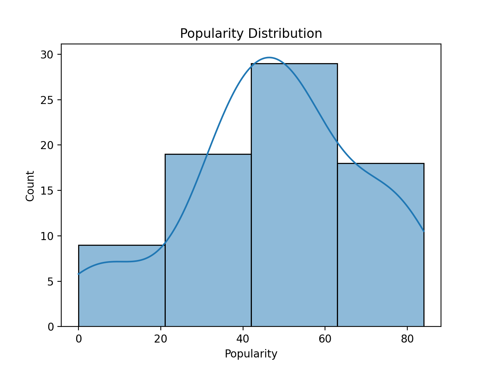
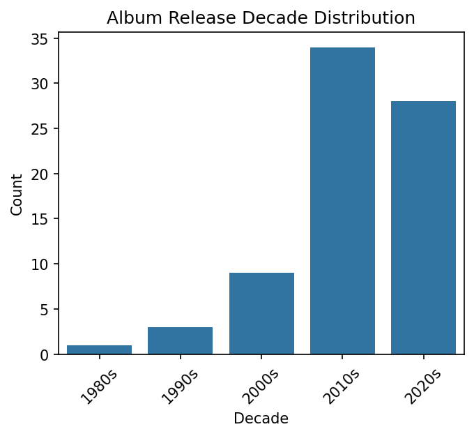
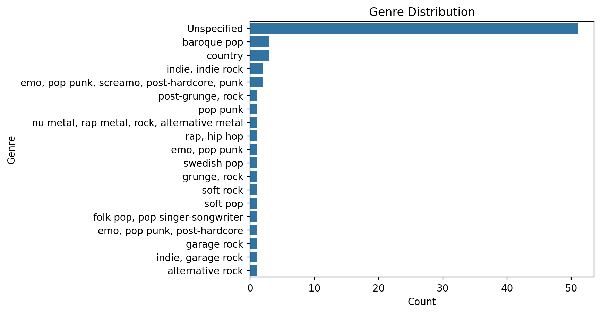
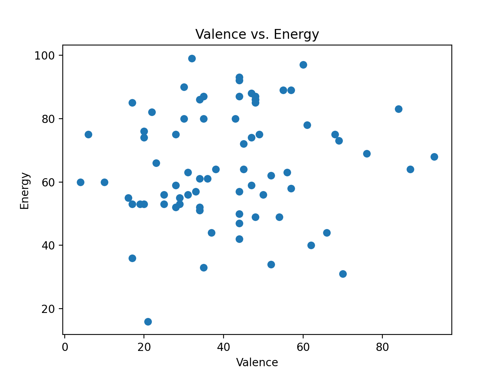
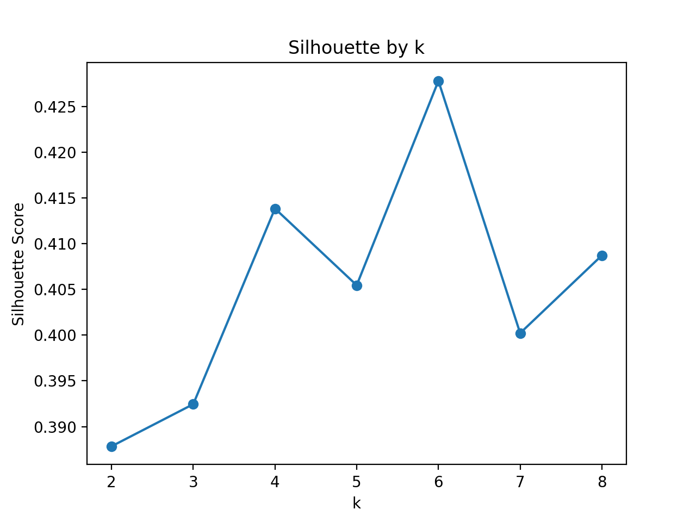

# playlist-analysis

## Introduction 

This project analyzes the measurable audio characteristics of songs curated for a moral judgment–themed playlist. The playlist was curated by the author to reflect a range of perceived moral postures, spanning from morally superior, judgment-driven stances to morally and emotionally exhausted ones. While the songs are not assumed to make explicit moral claims, they are interpreted as responding to perceived wrongdoing with varying degrees of moral certainty, agency, and exhaustion. 

## Methods 

The dataset consists of 75 songs curated by the author into a moral judgment–themed playlist. Audio features were extracted using a Spotify playlist exporter service and saved as a CSV file. In addition to audio features, Spotify popularity scores, album release year, and genre metadata were retrieved to support descriptive analysis.

As an exploratory analysis, songs were examined using Spotify audio features, with particular focus on energy and valence, to assess whether songs associated with different perceived moral postures clustered differently. 
- **Valence** reflects the emotional orientation of a song, ranging from darker, unresolved, or tense states to lighter, more resolved or affirming ones.
- **Energy** captures how forcefully a song presents itself, from low-intensity and restrained to high-intensity and driving.

To identify an appropriate number of clusters, k-means clustering was performed across a range of k values and evaluated using silhouette score. To support interpretation of the resulting clusters, the most popular songs within each cluster were examined qualitatively by reviewing their lyrics. This step was used to assess whether the clusters aligned with the perceived moral postures that motivated the original playlist curation.

## Results

### Popularity Distribution

Figure 1 illustrates the popularity distribution of songs included in the moral judgment–themed playlist. The playlist spans a wide range of popularity values, including both relatively obscure tracks and highly popular songs, demonstrating that the dataset includes both niche and mainstream music.

### Decade Distribution

Figure 2 shows the distribution of album release decades for songs in the playlist. The majority of tracks originate from the 2010s and 2020s, indicating that the playlist is predominantly composed of contemporary music.

### Genre Distribution

Figure 3 examines the distribution of genre labels for songs in the playlist. Spotify genre metadata is not consistently provided at the track level, resulting in missing genre data. While the available labels span a wide range of genres, they are sparse and highly fragmented. As a result, genre-based analysis was not pursued further.

### Valence vs. Energy

Figure 4 shows the distribution of songs plotted by valence and energy. Songs span a broad range of emotional orientation and intensity, with no clear linear relationship, suggesting potential structure suitable for clustering.

### Cluster Selection 

Figure 5 presents silhouette scores for k-means clustering across a range of k values (2-8). Among the values tested, k = 6 yielded the highest silhouette score and was selected for subsequent analysis. 

### Cluster Results

Figure 6 shows the results of k-means clustering applied to valence and energy (k = 6). The clusters occupy distinct regions of the valence–energy space, corresponding to different combinations of emotional orientation and intensity. Three of the six clusters are predominantly located above an energy value of 60, while the remaining clusters occupy mid-to-lower energy ranges.

#### Cluster Characteristics

Table 1 summarizes the mean valence, mean energy, and number of songs for each cluster.

| Cluster | Mean Valence | Mean Energy | Song Count |
|---------|--------------|-------------|------------|
| 0       | 79.50        | 72.00       | 6          |
| 1       | 25.90        | 56.81       | 21         |
| 2       | 25.75        | 82.42       | 12         |
| 3       | 51.29        | 49.94       | 17         |
| 4       | 49.25        | 84.88       | 16         |
| 5       | 24.33        | 28.33       | 3          |

## Discussion

The clustering results indicate that songs in the moral philosophy playlist differ not only in valence and energy, but also in their moral–emotional orientation. While the Results section established quantitative separation between clusters, the Discussion examines whether these groupings correspond to interpretable emotional stances by drawing on representative lyrical content.

To support interpretation, valence and energy were mapped onto moral–emotional states rather than treated as purely affective measures. In this framework, valence reflects how harm or injustice is appraised, while energy reflects how the narrator responds to that appraisal.

Valence is interpreted as follows: 
- **Low valence** = *Pessimism* - bleak expectations about change or repair
- **Medium valence** = *Woundedness* - acknowledgment of moral or relational injury
- **High valence** = *Outrage* - morally charged anger toward a perceived source of harm

Energy corresponds to a response posture: 
- **Low energy** = *Exhaustion*
- **Medium energy** = *Defensiveness*
- **High energy** = *Defiance* 

Together, these dimensions distinguish not only how negatively an experience is felt, but how that experience is managed. 

### Case 1: Low-Medium Valence & Medium Energy

Clusters 1 and 3 occupy similar ranges of energy but differ markedly in valence. Cluster 1 (n = 21; valence = 25.9; energy = 56.8) is characterized by low valence and moderate energy, whereas Cluster 3 (n = 17; valence = 51.3; energy = 49.9) shows substantially higher valence with comparable energy levels.

Despite this similarity in energy, the clusters diverge in moral–emotional orientation. Cluster 1 captures songs in which the narrator appears pessimistic and emotionally exhausted by societal and relational pressure, reflecting distress without a clearly identified moral breach. In contrast, Cluster 3 captures songs in which the narrator appears morally wounded and accusatory, indicating recognition of harm and attribution of responsibility while remaining engaged rather than confrontational.

#### Cluster 1 Lyric Samples

*“Way Down We Go”* by Kaleo (2016)

> They will run you down, down ’till you fall  
> And they will run you down, down to your core  
> Yeah, ’till you can’t crawl no more  
> And way down we go-o-o-o-o  

*“Heart-Shaped Box”* by Nirvana (1993)

> Hey  
> Wait  
> I got a new complaint  
> Forever in debt to your priceless advice.  

*“Apologize”* by Timbaland, OneRepublic (2007)

> You tell me that you need me  
> Then you go and cut me down, but wait  
> You tell me that you’re sorry  
> Didn’t think I’d turn around and say  
> That it’s too late to apologize  
> It’s too late

#### Cluster 3 Lyric Samples

*labour* by Paris Paloma (2023)
> The capillaries in my eyes are bursting  
> If our love died, would that be the worst thing?  
> For somebody I thought was my saviour  
> You sure make me do a whole lot of labour 

*Cringe* by Matt Maeson (2019)
> She said I'm looking like a bad man, smooth criminal  
> She said my spirit doesn't move like it did before  
> She said that I don't look like me no more, no more  
> I said, "I'm just tired"

*Glue Myself Shut* by Noah Kahan (2020)
> You never asked once   
> No, you never asked why   
> If I was putting things off    
> If I was drinking too much of that red wine   

#### **Cluster 4 (Medium Valence, High Energy)**

Cluster 4 contains the third largest number of songs (n = 16) and is characterized by medium valence (49.3) and high energy (84.9). This cluster captures songs in which the narrator appears morally wounded, powerless, and rejecting. 

**Lyric samples:**

*Bleed It Out* by Linkin Park (2007)
> This hurts, I won't lie   
> Doesn't matter how hard I try      
> Half the words don't mean a thing      
> And I know that I won't be satisfied        

> I bleed it out, diggin' deeper just to throw it away  

*Black Out Days* by Phantogram (2014)
> Speak in tongues    
> I don't even recognize your face   
> Mirror on the wall        
> Tell me all the ways to stay away     
> Away-ay ya          

*Cute Without The 'E' (Cut From The Team)* by Taking Back Sunday (2002)
> Hoping for the best, just hoping nothing happens  
> A thousand clever lines unread on clever napkins  
> I will never ask if you don't ever tell me    
> I know you well enough to know you'll never love me   

> And all of this was all your fault

## Discussion

The clustering results indicate that songs in the moral philosophy playlist form distinct groupings across valence and energy. While the Results section demonstrated quantitative separation, the Discussion evaluates whether these clusters correspond to interpretable moral–emotional themes by examining the most popular songs within each cluster.

### Dichotomy 

Cluster 1: Annoyed and Defensive -> Pessimistic 
Cluster 3: Wounded and Defensive -> Accusatory 
Cluster 4: Wounded and Powerless -> Rejecting 

Cluster 0: Confrontational and Defiant
Cluster 2: Annoyed and Defiant
Cluster 5: Wounded and Exhausted

Annoyed/Wounded 

Defiant, Powerless, Exhausted

Valence 
Low = Pessimistic 
Medium = Wounded
High = Outraged 

Energy
Low = Exhausted
Medium = Defensive
High = Defiant 

Case 1
Low-Medium Valence & Medium Energy
C1: Pessimistic + Defensive 
C3: Wounded + Defensive

Case 2
Low-Med-High Valence & High Energy
C2: Pessimistic + Defiant 
C4: Wounded + Defiant 

Case 3
High Valence & High Energy
C0: Outraged + Defiant 

Case 4
Low Valence & Low Energy
C5: Pesimissitc + Exhausted 