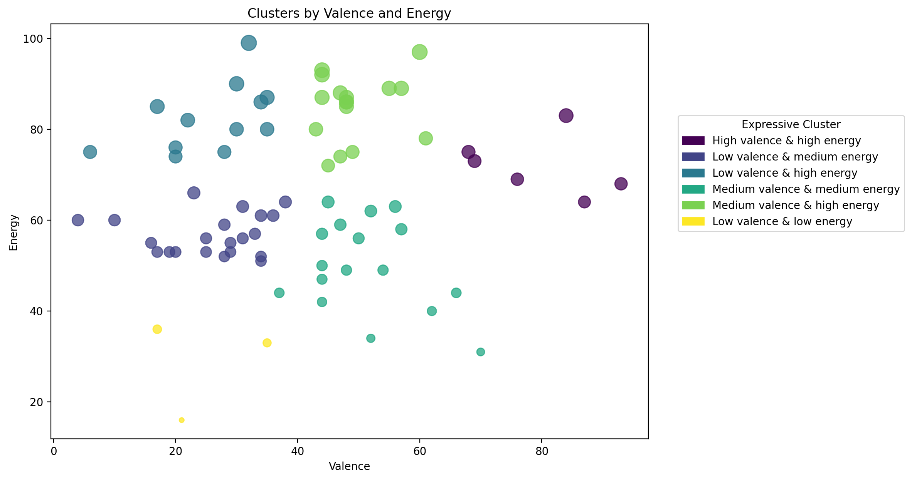

# playlist-analysis

## Purpose

This project analyzes the measurable audio characteristics of songs curated for a moral judgment–themed playlist. The playlist was curated by the author to reflect a range of perceived moral postures, spanning from morally superior, judgment-driven stances to morally and emotionally exhausted ones. While the songs are not assumed to make explicit moral claims, they are interpreted as responding to perceived wrongdoing with varying degrees of moral certainty, agency, and exhaustion. 

## Exploratory Analysis

As an exploratory analysis, songs were examined using Spotify audio features, with particular focus on energy and valence, to assess whether songs associated with different perceived moral postures clustered differently in audio feature space.
- **Valence** captures the emotional tone of a song, ranging from negative or unresolved affect to more positive or triumphant affect.
- **Energy** reflects the song’s intensity and forcefulness, ranging from subdued or restrained to forceful or driving.

## Methods
The dataset consists of 75 songs curated by the author into a moral judgment–themed playlist. Audio features were extracted using a Spotify playlist exporter service and saved as a CSV file. In addition to audio features, Spotify popularity scores, album release year, and genre metadata were retrieved to support descriptive analysis.

## Results

### Popularity Distribution

Figure 1 illustrates the popularity distribution of songs included in the moral judgment–themed playlist. he playlist spans a wide range of popularity values, including both relatively obscure tracks and highly popular songs, demonstrating that the observed patterns are not driven exclusively by niche or mainstream music.

### Decade Distribution

Figure 2 shows the distribution of album release decades for songs in the playlist. The majority of tracks originate from the 2010s and 2020s, indicating that the moral judgment theme, as curated here, is primarily expressed through contemporary music.

### Genre Distribution

Figure 3 examines the distribution of genre labels for songs in the playlist. Spotify genre metadata is not consistently provided at the track level, resulting in missing genre data. While the available labels span a wide range of genres, they are sparse and highly fragmented. Due to this inconsistency, genre-based analysis was not pursued further. 

## REVISE 

### Expressive Clusters (KMeans on Energy, Valence, Acousticness)

**Cluster 0: Direct moral affirmation or self-assertion**  
High energy, high valence, low acoustic
*(direct delivery + emotionally positive affect)*

**Cluster 1: Reflective moral certainty**  
Moderate energy, lower valence, high acoustic
*(reflective delivery + sober, introspective affect)*

**Cluster 2: Direct moral opposition or critique**  
High energy, low valence, low acoustic 
*(direct delivery + emotionally negative affect)*

**Cluster 3: Unresolved moral unease**  
Moderate energy, very low valence, low acoustic
*(restrained delivery + emotionally unresolved affect)*

## Cluster Visualization

*Clusters projected onto valence and acousticness. Point size encodes energy, illustrating how intensity differentiates overlapping expressive modes in 2D space.*

### Qualitative Validation Note

Representative tracks were reviewed qualitatively to sanity-check cluster interpretations. Lyrics were considered only at a high level to confirm emotional resolution and delivery style, not used as features in modeling. All clustering and analysis are based solely on audio and popularity features.

### Future Work

Possible extensions of this project include incorporating lyrical analysis to compare semantic themes with audio-based expressive clusters, expanding the dataset to include multiple playlists or curators, and testing whether similar expressive modes emerge across genres or cultural contexts. These directions were intentionally deferred to preserve the interpretability and scope of the current analysis.
